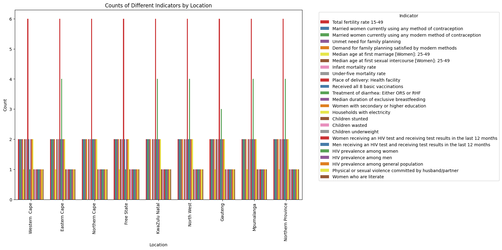
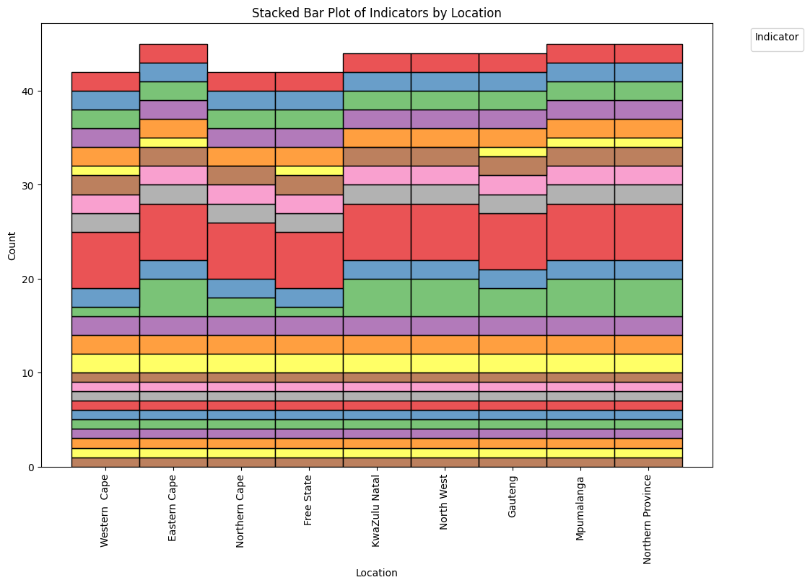

# South Africa Subnational Demographic and Health Data Analysis


## Overview

This repository contains an analysis of subnational demographic and health data for South Africa. The dataset was obtained from the [Humanitarian Data Exchange (HDX)](https://data.humdata.org/dataset/dhs-subnational-data-for-south-africa) and provides valuable insights into various demographic and health indicators at the subnational level within South Africa.

## Dataset Description

The dataset includes the following columns:

- `ISO3`: ISO 3166-1 alpha-3 country code.
- `Location`: Subnational location within South Africa.
- `DataId`: Unique identifier for the data.
- `Indicator`: Demographic and health indicators.
- `Value`: Numeric value for the indicator.
- `Precision`: Precision of the indicator value.
- `DHS_CountryCode`: Country code for South Africa.
- `CountryName`: Name of the country (South Africa).
- `SurveyYear`: Year of the survey.
- `SurveyId`: Unique identifier for the survey.
- ... (additional columns)

## Analysis and Visualizations

### 1. Distribution of Indicators by Location



In this analysis, we visualize the distribution of different indicators by location within South Africa using a bar plot. This helps us understand how various indicators vary across subnational regions.

### 2. Stacked Bar Plot of Indicators by Location



A stacked bar plot is created to show the distribution of indicators within each location. This visualization provides insights into the composition of indicators within each subnational region.

### 3. Average Values by Location and Indicator

We calculated and displayed the average values for each combination of location and indicator. This allows us to identify trends and variations in indicator values across different regions.

### 4. Identifying Highs and Lows

We identified locations with the highest and lowest average values for specific indicators. This information can be valuable for policymakers and researchers interested in understanding regional disparities.

## Getting Started

To replicate the analysis or explore the dataset further, follow these steps:

1. Clone this repository to your local machine:

   ```
   git clone [https://github.com/omnilux/south-africa-demographic-data.git](https://github.com/Omnilux24/South-Africa---Subnational-Demographic-and-Health-Data)
   ```

2. Install the required Python libraries by running:

   ```
   pip install -r requirements.txt
   ```

3. Run the Jupyter Notebook files provided in the `notebooks` directory to reproduce the analysis and visualizations.

## Contributing

Contributions to this project are welcome! If you have ideas for improvements, additional analyses, or new visualizations, please open an issue or submit a pull request.

## License

This project is licensed under the [MIT License](LICENSE).

## Acknowledgments

- The dataset used in this project is sourced from the [Humanitarian Data Exchange (HDX)](https://data.humdata.org/dataset/dhs-subnational-data-for-south-africa).
- Special thanks to the data providers and the open-source community for making this analysis possible.

## Contact

For questions, suggestions, or collaborations, please contact [Tsakonovela](info@tsakonovela.com).

---

